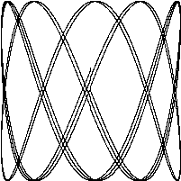

# lissajous

接下来的程序生成一个GIF



```go
// Lissajous generates GIF animations of random Lissajous figures.
package main

import (
    "image"
    "image/color"
    "image/gif"
    "io"
    "math"
    "math/rand"
    "os"
    "time"
)

var palette = []color.Color{color.White, color.Black}

const (
    whiteIndex = 0 // first color in palette
    blackIndex = 1 // next color in palette
)

func main() {
    // The sequence of images is deterministic unless we seed
    // the pseudo-random number generator using the current time.
    // Thanks to Randall McPherson for pointing out the omission.
    rand.Seed(time.Now().UTC().UnixNano())
    lissajous(os.Stdout)
}

func lissajous(out io.Writer) {
    const (
        cycles  = 5     // number of complete x oscillator revolutions
        res     = 0.001 // angular resolution
        size    = 100   // image canvas covers [-size..+size]
        nframes = 64    // number of animation frames
        delay   = 8     // delay between frames in 10ms units
    )

    freq := rand.Float64() * 3.0 // relative frequency of y oscillator
    anim := gif.GIF{LoopCount: nframes}
    phase := 0.0 // phase difference
    for i := 0; i < nframes; i++ {
        rect := image.Rect(0, 0, 2*size+1, 2*size+1)
        img := image.NewPaletted(rect, palette)
        for t := 0.0; t < cycles*2*math.Pi; t += res {
            x := math.Sin(t)
            y := math.Sin(t*freq + phase)
            img.SetColorIndex(size+int(x*size+0.5), size+int(y*size+0.5),
                blackIndex)
        }
        phase += 0.1
        anim.Delay = append(anim.Delay, delay)
        anim.Image = append(anim.Image, img)
    }
    gif.EncodeAll(out, &anim) // NOTE: ignoring encoding errors
}
```

## import

当我们import了一个包路径包含有多个单词的package时，
比如image/color（image和color两个单词），
通常我们只需要用最后那个单词表示这个包就可以。
所以当我们写color.White时，
这个变量指向的是image/color包里的变量，
同理gif.GIF是属于image/gif包里的变量。

```go
import (
    "image"
    "image/color"
    "image/gif"
    "io"
    "math"
    "math/rand"
    "os"
    "time"
)
```

## const

该程序的常量声明中给出了一系列的常量值，
常量指在程序中不会变化的值。
目前常量声明的值必须是一个数字值、字符串或者一个固定的boolean值。

```go
const (
    whiteIndex = 0 // first color in palette
    blackIndex = 1 // next color in palette
)
```

## `[]color.Color{...}` & `gif.GIF{...}`

`[]color.Color{...}`和`gif.GIF{...}`是两个复合声明。
`[]color.Color{...}`是一个切片，
`gif.GIF{...}`是一个结构体。

```go
var palette = []color.Color{color.White, color.Black}
```

## 生成GIF

`lissajous`函数生成了一个GIF动画，
内部有两层嵌套循环，
外层循环是生成64帧动画，
内层循环是生成每一帧的图像。

```go
func lissajous(out io.Writer) {
    const (
        cycles  = 5     // number of complete x oscillator revolutions
        res     = 0.001 // angular resolution
        size    = 100   // image canvas covers [-size..+size]
        nframes = 64    // number of animation frames
        delay   = 8     // delay between frames in 10ms units
    )

    freq := rand.Float64() * 3.0 // relative frequency of y oscillator
    anim := gif.GIF{LoopCount: nframes}
    phase := 0.0 // phase difference
    for i := 0; i < nframes; i++ {
        rect := image.Rect(0, 0, 2*size+1, 2*size+1)
        img := image.NewPaletted(rect, palette)
        for t := 0.0; t < cycles*2*math.Pi; t += res {
            x := math.Sin(t)
            y := math.Sin(t*freq + phase)
            img.SetColorIndex(size+int(x*size+0.5), size+int(y*size+0.5),
                blackIndex)
        }
        phase += 0.1
        anim.Delay = append(anim.Delay, delay)
        anim.Image = append(anim.Image, img)
    }
    gif.EncodeAll(out, &anim) // NOTE: ignoring encoding errors
}
```
### append

`append`是一个内建函数，
用于向切片追加元素。

```go
anim.Delay = append(anim.Delay, delay)
anim.Image = append(anim.Image, img)
```
该函数的第一个参数是一个切片，
第二个参数是要追加的元素。

这里我们向`anim.Delay`和`anim.Image`追加了`delay`和`img`。
即每一帧的延迟和图像。

### out

`lissajous`函数的参数`out`是一个`io.Writer`类型，这个类型支持把输出结果写到很多目标。

### gif.EncodeAll

`gif.EncodeAll`函数将生成的动画写入到`out`中。

```go
gif.EncodeAll(out, &anim) // NOTE: ignoring encoding errors
```

